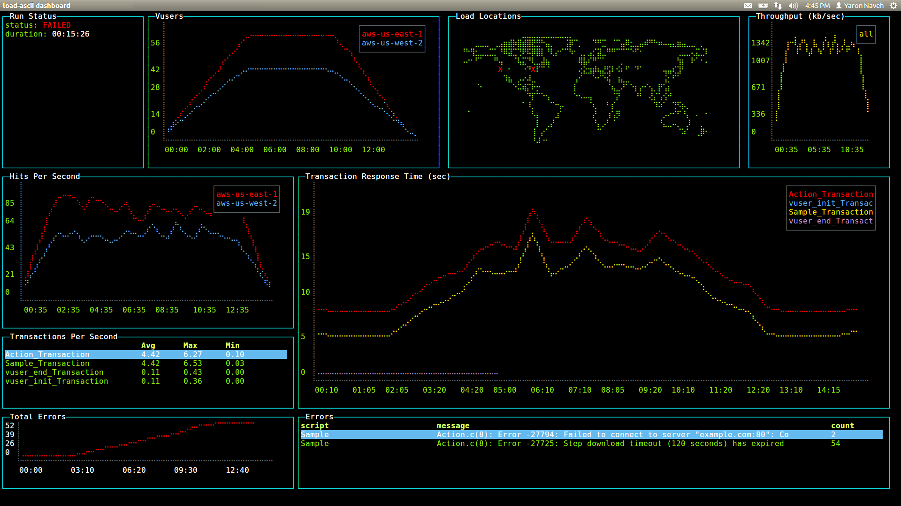
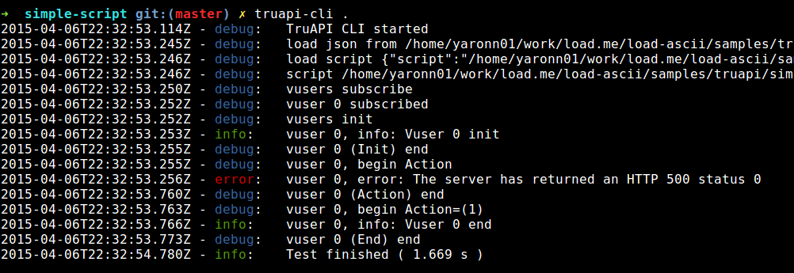
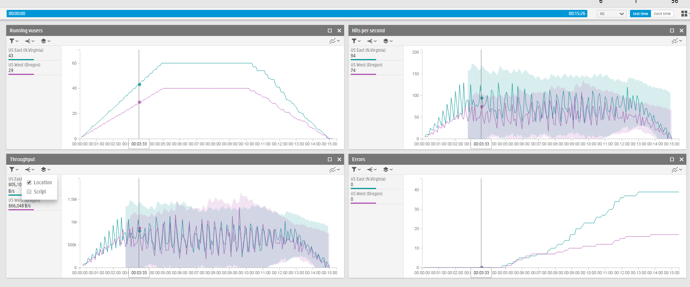

# TruLoad

Beautiful load testing in the terminal using ascii-art.

Use as standalone or as a complement to the [StormRunner load testing](https://saas.hp.com/software/stormrunner-load) service. More information in [blessed-contrib](https://github.com/yaronn/blessed-contrib) and [twitter](http://twitter.com/YaronNaveh).



**Features:**

* Author load tests with Node.JS
* Use any IDE / source control
* Run the tests using the command line
* Run locally or on the cloud
* View results in the terminal using ascii-art (or in the browser, if that's your style)

## Installation

You need to have NodeJS ([installed](https://nodejs.org/download/)). Then:

`````javascript
npm install truapi truload -g
`````

TruLoad runs on Linux, Mac and Windows. Running on Windows requires some [pre-requisites](http://webservices20.blogspot.co.il/2015/04/running-terminal-dashboards-on-windows.html).

If you get permission issues then "sudo npm..." might work. However usually it is better configure the right [premissions](http://competa.com/blog/2014/12/how-to-run-npm-without-sudo/) instead.

## Usage

Follow those steps to create your first TruLoad test:

1. Create a new folder "my test"
2. Create a new file test1.js:

    `````javascript
    var r = require('request')

    module.exports = function (vuser) {
        vuser.action('My API', function (ctx, done) {
            ctx.transaction.start('buy');
            buy(function(err) {
                ctx.transaction.end('buy', err ? ctx.transaction.FAIL : ctx.transaction.PASS); 
                done()    
            })
        })
    }

    function buy(cba) {
        setTimeout(cba, 2000)
    }

    /*
    function buy(cba) {
        r("http://your.api.com/buy", function(err, res, body) {
            if (res.statusCode != 200 || err) cba("status code is: " + res.statusCode);
            else cba()
        })
    }
    */
    `````

    This is your test flow. It is very simple:

    * implement the vuser.action by writing your business flow (e.g. API call, login+buy flow etc). Use any javascript or NodeJS module.
    * Remember to call done() when you're done (call it only once).
    * Wrap any interesting business flow with start and end transaciton so you could see measurements. You can wrap a single API call or a full business flow.

    The scriptting framework is called TruAPI and you should check out its [full documentation](https://stormrunner-load.saas.hp.com/doc/PTaaS/PTaaS.htm#cshid=1010).

3. Create package.json:

    `````javascript
    {
        "name": "test",
        "version": "0.0.1"  
    }
    `````

    If your script uses some npm module you should also define it here either by editing the file or running "npm install request --save".

4. create truapi.json:

    `````javascript
    {
      "test": {
        "script": "test.js"
      },
      "local": {
         "vuserCount": 2,
        "policy": {
          "start": { "type": "allTogether" },
          "duration": { "type": "iterationBased", "param": 1 },
          "end": { "type": "allTogether" }
        }
      },
      "cloud": {
        "vuserCount": 5,
        "policy": {
          "duration": 60,
          "rampUp": 30,
          "tearDown": 30,
          "pacing": 1
        },
        "distribution": {
          "aws-us-east-1": 100      
        }
      },
      "transactions": ["map"]
    }
    `````

    Here you define the test properties both for local runs and cloud runs.

    `vuserCount` is number of virtual users to run.

    You should also define the `duration`, `ramp up`, and `tear down` (values are in seconds). For cloud runs also define the distribution between various cloud providers and geogrpahies (values are in percents).

5. First run this test locally:

    `````javascript
    $> truapi .
    `````

    

    (If you get errors you than possibly truapi was not installed correctly.)

    The terminal will now show the execution log for the local run. After the run several .csv and .log files are created in the local folder with the run results. No need to look at them now – this run was just to verify that the test is valid, which you can do by searching for unexpected errors in the output log.

    Now we are ready to run the test in the cloud and view the results using ascii-art.

6. First, you need to [register for StormRunner](https://saas.hp.com/software/stormrunner-load) (choose the free trial). StormRunner is a cloud load testing service. 

    You can further investigate the StormRunner web application now or at any time later but it is optional for our flow.

    

7. You can now take a look in the results of a sample test:

    `````javascript
    $> truload dashboard --u=[your email] --p=[your password] --tid=[your tenant id] --rid=1
    `````

    **Parameters:**

    **u** - the email you registered with to StormRunner

    **p** - the password you chose for StormRunner

    **tid** - your StormRunner tenantId. You can get your tenantId by looking at the TENANTID parameter of the query string in any page of StormRunner. For example if after launching StormRunner the browser url bar shows https://stormrunner-load.saas.hp.com/?TENANTID=1234 then your tenantId is 1234.

    **rid** - The id of the run you want to see in the dashboard. 
The id is printed to the terminal when you start a run and also appears in the browser url bar when you view the run results. The value 1 is always valid since it is the id of the sample run which ships with your account.

    

8. (optionally) We will now upload the TruAPI test to the StormRunner cloud and run it there. Make sure your command prompt is in the same folder where you wrote the TruAPI test before. Also verify that the folder contains only the required files for the test as the next command will upload the current folder and all of its subfolders to the secured StormRunner cloud.

    `````javascript
    $> truload run --u=[your email] --p=[your password] --tid=[your tenant id]
    `````

    The command parameters are the same as in the previous step, except r (run id) which is not required here.

    Depending on the cloud weather, the above command may take several minutes to complete. If you stop it before it completes then the test will not be executed. Once the test is running you will see the live results in ascii-art in your terminal:

## More Information
truload is implemented on top of [blessed-contrib](https://github.com/yaronn/blessed-contrib), an open source Node.JS library for building terminal dashboards (more details in [github](https://github.com/yaronn/blessed-contrib) or  [twitter](http://twitter.com/YaronNaveh)).
